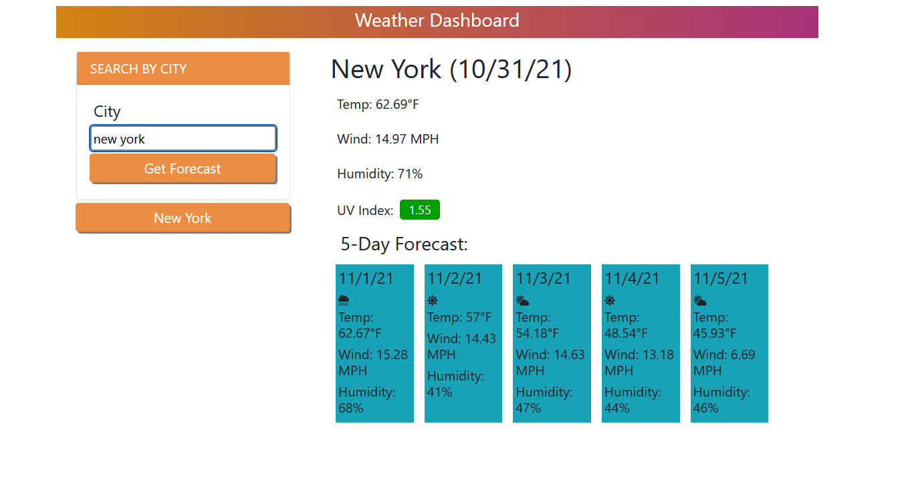

# Weather Dashboard

<a href="https://raealejandrino.github.io/weather-dashboard/">Weather Dashboard Link</a>

## The Repository

This repository is where I (Rae Alejandrino) write and implement a working weather dashboard using several server-side API's, JavaScript, CSS (Bootstrap), and HTML.

## Weather Dashboard

In this repository, you can find a <a href="https://raealejandrino.github.io/weather-dashboard/">live</a> url deployment of a fully functioning weather dashboard! Upon visitng the web address, you can input any city into the search query and return the current forecast along with a five day forecast for the corresponding location. Additionally, any city you have previously searched will be saved under the search box. This way you can close, refresh, or re-open your browser and still check previously searched locations without re-typing the city into the search query!